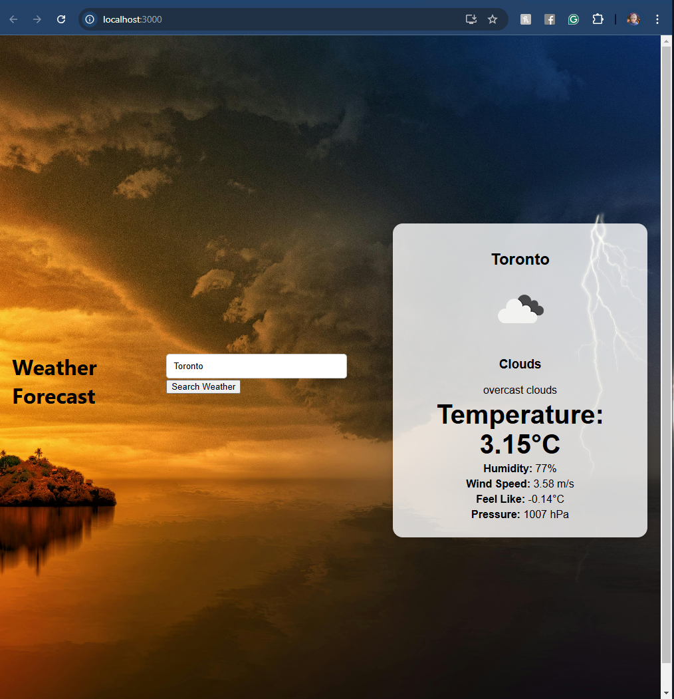
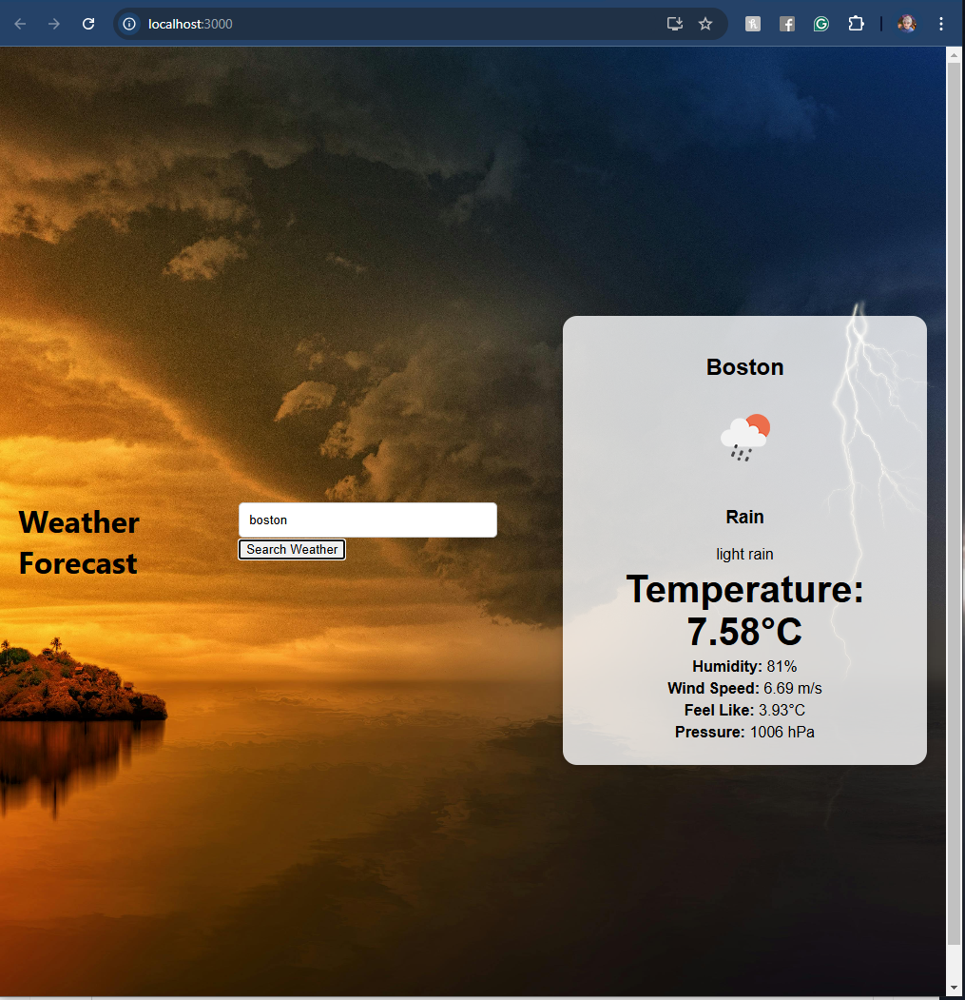
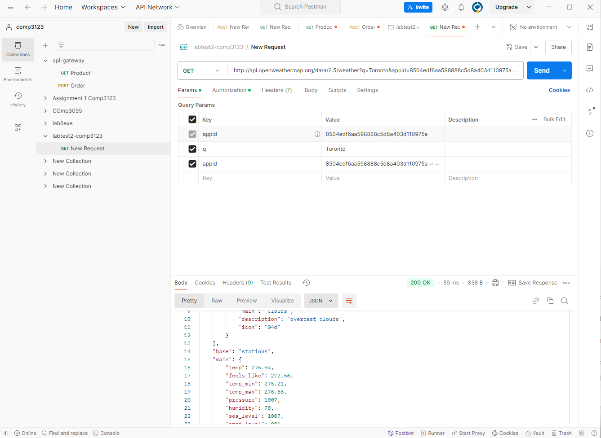

# LabTest 2 
## 101460443 - Ryan Tran

## Weather App
This is a weather app that uses the OpenWeatherMap API to fetch and display current weather data for a specified city.
The default city is Toronto.
Search bar is for the search the weather for different cities.

### Screen shots

#### Default screen

 Default screen when open the page - Toronto Weather

#### Search by city feature
 

 Search weather of Different City - Boston using the search bar

#### Postman Test - Get request

Test request from OpenWeatherMap API
Default API
 http://api.openweathermap.org/data/2.5/weather?q=Toronto&appid=8504edf6aa598888c5d8a403d110975a

Search for Dynamic Page:
https://api.openweathermap.org/data/2.5/weather?q=${city}&appid=${API_KEY}&units=metric

 

 ### API Key

This app uses the OpenWeatherMap API, which requires an API key added in .env file
